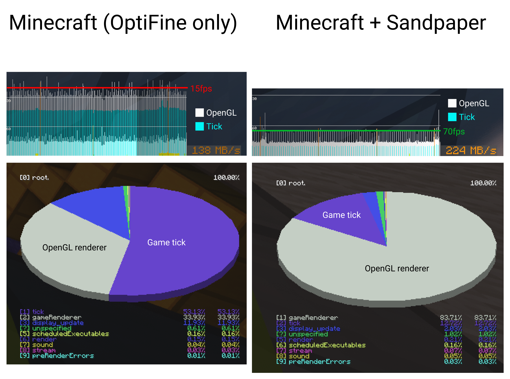

	

Sandpaper is a free and open-source optimization mod for the Minecraft client that improves frame rates, reduces micro-stutter, and fixes graphical issues in Minecraft.

## Technical details

When connected to a multiplayer server, the Minecraft client synchronizes a local copy of the multiplayer world. Objects represented by entities are simulated both on the server and the client.

Minecraft runs at a fixed rate of 20 game ticks per second, where entities are updated in accordance with physics, momentum, and collision. However, client-side game ticks are computed on the main thread, which also runs the OpenGL rendering system, causing a lag spike every 50ms. In a world with a high amount of entities, the significant tick duration leads to an effective frame rate of 20 fps, despite the average frame rate running at above 60 fps. 

Sandpaper offloads a significant portion of Minecraft's client-side game ticks to an internal thread pool, which performs the necessary calculations related to entities. Entity updates are parallelized and synchronized by neighboring chunk boundaries, allowing independent behavior to operate simultaneously. This greatly reduces the lag spike caused by the client-side tick duration, resulting in smoother gameplay.

Sandpaper is compatible with renderer optimization mods, including [OptiFine](https://optifine.net/home) and [Sodium](https://modrinth.com/mod/sodium). While Sandpaper is focused on the client tick, OptiFine and Sodium both optimize the OpenGL renderer itself. It is recommended to use both sets of optimizations together for the best possible performance.

## Building from source

### Requirements

- OpenJDK 8 (required by Minecraft Forge)

### Building with Gradle

Sandpaper uses a typical Gradle project structure and can be built by simply running the default `build` task. After Gradle finishes building the project, you can find the build artifacts (typical mod binaries, and their sources) in `build/libs`.
